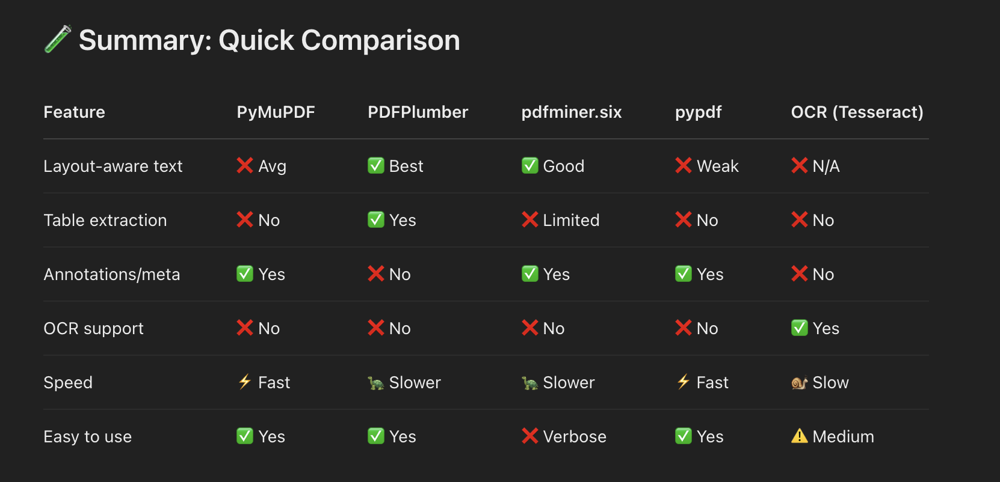
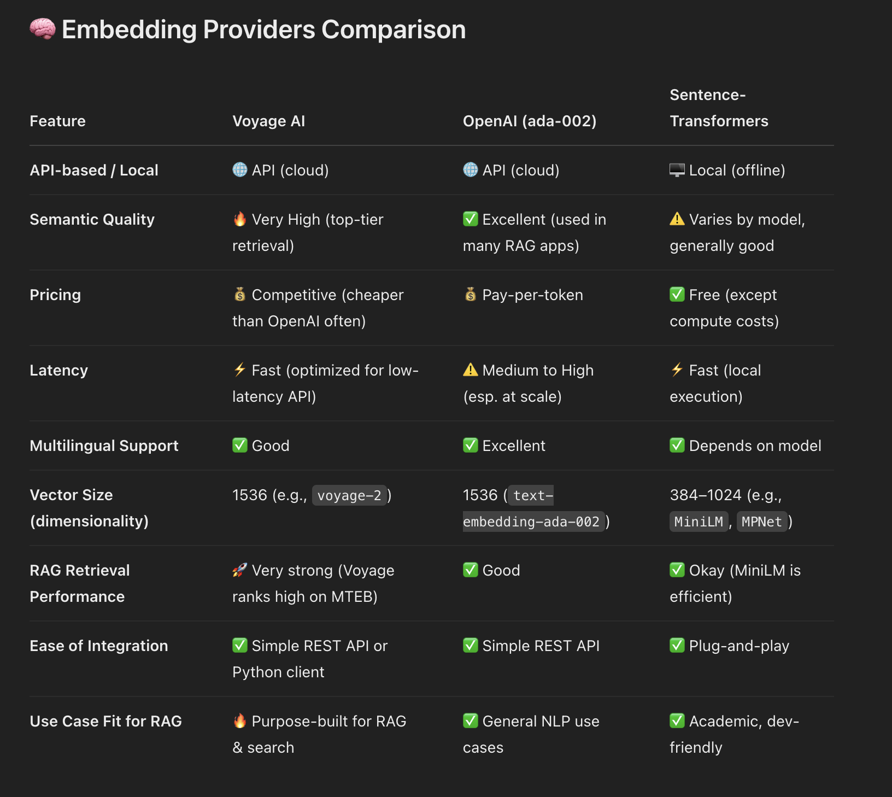
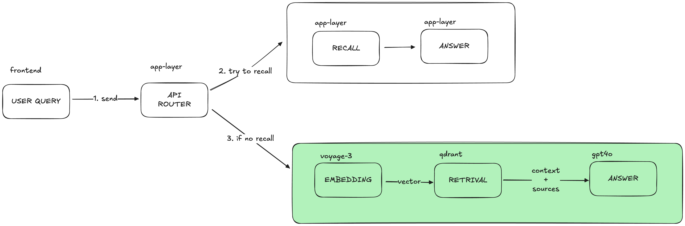
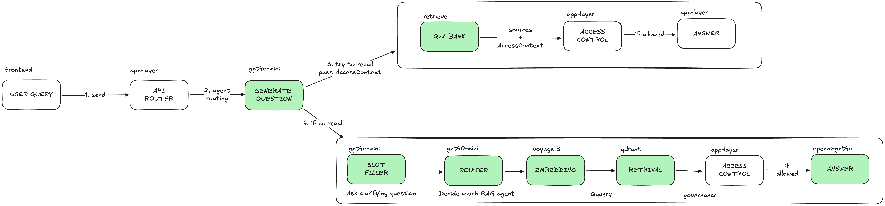
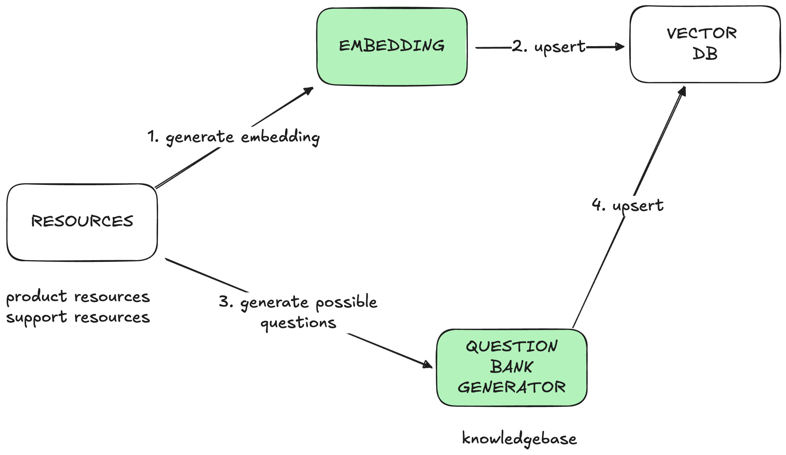

# Alltius RAG agent

- This is a RAG agent that can answer user queries from support documentations.
- Currently it's indexed with
  - Insurance: insurance policy documents from pdf files &
  - Stock broker: support documents from URL

## Constraints

- Due to cost and time constraints, it's trained on limited resources
- Angelone
  - https://www.angelone.in/support/add-and-withdraw-funds/add-funds
  - https://www.angelone.in/support/add-and-withdraw-funds/quarterly-settlement-sebi-payout
  - https://www.angelone.in/support/add-and-withdraw-funds/withdraw-funds
- Insurance
  - America's_Choice_2500_Gold_SOB (1) (1).pdf
  - America's*Choice_Medical_Questions*-_Modified_(3) (1).pdf

## Features

- It has 2 different collections for data isolation by vendor.
- It support pdf ingestion & web url ingestion.

## Choice of solution

- PDF ingestion - pdfplumber
  

- Embedding model - voyageai-voyage3
  

## Architecture

### Current

- Green boxes: LLM agent
- White boxes: app-layer

### Choice of models

- Embedding



- Currently we have a proof of concept system
- User query is sent to backend API router,

  - it tries to recall if we have seen the question before, if recalled, answer is returned instantly
  - if no recall, it's a new question so we retrive it from vector DB

- The system caches query, answer & sources in recall to control cost

- Caveats:
  - Similar questions but with different wording can cause no recall, which is costly
  - The system is not able to ask clarifying questions to the user
  - There is no governance layer

### Future - scalable



- To scale the system, we need to implement multiple agents
- To solve no recall for similar questions, we create a QnA bank at the time of ingest
- To solve for asking clarifying questions, slot filler agent will ask questions to gather required information
- There can be a router agent that decides which agents to pass the query to, it could be another RAG chain or agent that can call other internal API's
- To solve for governance, access control layer is implemented

### Resource ingestion



- When ingesting the resource, we maintain data isolation per tenant by collections
- We store both the embeddings and source together
- The ingest pipeline also generates QnA bank for quick anwersing of frequently asked questions

## Tech stack

- Backend: Python, Flask
- Frontend: NextJS
- LLM
  - VectorDB: Qdrant
  - Embedding model: VoyageAI
  - Answer model: gpt4o (final answer from context)
  - Enriching model: gpt4o-mini (slot filler, routers, knowledgebase generation, question generation)

## How to run

### Config

- OpenAI API key
- VoyageAI API Key
- Qdrant API Key

### Backend

- Setup dev environment

```shell
cd backend
python3 -m venv .venv
source .venv/bin/activate
```

- Install requirements

```shell
pip install -r requirements.txt
```

- Run app (flask server)

```shell
python3 app.py
```

### Frontend

- Setup dev environment

```shell
cd frontend
```

- Install requirements

```shell
npm install
```

- Run app (flask server)

```shell
npm run dev
```

## API's

- Chat API

**Request**

```shell
curl --location 'http://localhost:5050/api/v1/rag/chat' \
--header 'Content-Type: application/json' \
--data '{
    "query": "Is there a limit on the amount of funds that I can add to my Angel One account?",
    "collection": "alltius_rag_chunks_angelone"
}'
```

**Response - success**

```json
{
  "answer": "Yes, there is a limit on the amount of funds that you can add to your Angel One account. The limit for fund addition via UPI is 1 lakh per day. For net banking, the limit will be applicable as per the bank account.",
  "sources": [
    "https://www.angelone.in/support/add-and-withdraw-funds/add-funds"
  ]
}
```

- Health API

```shell
curl --location 'http://localhost:5050/api/v1/rag/health'
```

**Response - success**

```json
{
  "status": "healthy",
  "timestamp": "2025-04-04T04:22:17.116120+00:00Z"
}
```

- Error response - common to all API's

```json
{
  "error": "Invalid collection"
}
```

## Optimisations

### Reduce hallucinations - check semantic distance / relevance score

- We can access the distance score from Qdrant and set a cutoff:

```python
hits = qdrant.search(
    collection_name=COLLECTION_NAME,
    query_vector=vector,
    limit=top_k,
    with_payload=True,
    with_vectors=False
)

# Check score threshold
if all(h.score < 0.6 for h in hits):  # adjust threshold
    return None, None
```

### Security - Access control

- We can pass `AccessContext` from the API routes down to the service layer
- `AccessContext`: `{user_id, tenant_id, collection_id}`
- There will be an access control layer that decides given an `AccessContext` and `sources`, it it allowed or not

### Tracing, caching & feedback - Langfuse

- Currently in this project there is no tracing thus we cannot record feedback & score the output
- Prompt caching is not available, this is required to control cost
- We can use langfuse to implement these in future

### User perceived latency - Streaming

- Currently in this project we are not using streaming from models
- We can stream from models and stream the response to frontend usig SSE (server-sent-event) in future so the response delay from the chatbot seems less
